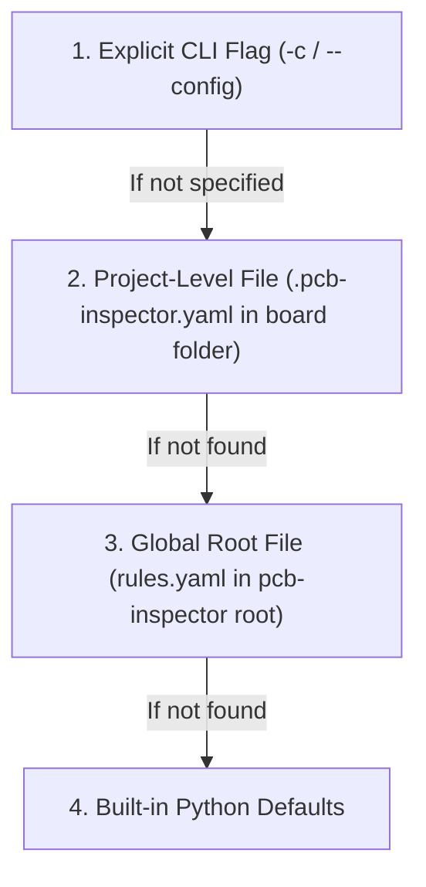

# pcb-inspector User Manual & Configuration Guide

This manual provides practical instructions for using `pcb-inspector`, configuring rules, setting up per-project overrides, and integrating automated PCB audits into your design workflows and CI/CD pipelines.

---

## Table of Contents

1. [Quickstart & Basic CLI Usage](#1-quickstart--basic-cli-usage)
2. [CLI Commands & Options](#2-cli-commands--options)
3. [Configuration System](#3-configuration-system)
   - [Configuration Resolution Hierarchy](#configuration-resolution-hierarchy)
   - [Global Configuration (`rules.yaml`)](#global-configuration-rulesyaml)
   - [Per-Project Overrides (`.pcb-inspector.yaml`)](#per-project-overrides-pcb-inspectoryaml)
4. [Configuration Parameters Reference](#4-configuration-parameters-reference)
5. [Active Inspection Rules Catalog](#5-active-inspection-rules-catalog)
6. [CI/CD & Automated Pipelines](#6-cicd--automated-pipelines)

---

## 1. Quickstart & Basic CLI Usage

### Check Environment & KiCad Detection
Verify that `pcb-inspector` and `kicad-cli` are correctly detected:
```bash
pcb-inspector version
```

### List Active Inspection Rules
See all registered heuristic and deterministic rules:
```bash
pcb-inspector rules
```

### Inspect a KiCad Project or Board
Run a full design audit on a project or PCB file:
```bash
# Audit a KiCad PCB layout
pcb-inspector check path/to/board.kicad_pcb

# Audit a complete KiCad project folder
pcb-inspector check path/to/project_dir/

# Audit with a Markdown report exported to file
pcb-inspector check path/to/board.kicad_pcb -o report.md -f markdown

# Audit with strict CI exit code on WARNING or CRITICAL
pcb-inspector check path/to/board.kicad_pcb --fail-on WARNING
```

---

## 2. CLI Commands & Options

### `pcb-inspector version`
Displays the installed version of `pcb-inspector` and the detected `kicad-cli` path and version.

### `pcb-inspector rules`
Prints a formatted table of all currently registered rules, their unique Rule ID, category, and default severity.

### `pcb-inspector check [OPTIONS] PROJECT_PATH`
Runs a full 3-layer verification audit on a KiCad project.

| Option | Flag | Default | Description |
| :--- | :--- | :--- | :--- |
| `PROJECT_PATH` | *(Argument)* | *(Required)* | Path to `.kicad_pro`, `.kicad_pcb`, `.kicad_sch`, or project directory. |
| `--output` | `-o` | `None` | Path where the audit report will be written. |
| `--format` | `-f` | *(none)* | `markdown`, `md`, `json`, `html`, `both` (markdown + json) or `all`. Unknown values are rejected. Without `--output`, reports go to `output_dir`. |
| `--fail-on` | N/A | `CRITICAL` | Severity threshold triggering exit code `1`: `CRITICAL`, `WARNING`, `SUGGESTION`. |
| `--config` | `-c` | `None` | Explicit path to a custom YAML configuration file. It must exist. |
| `--vision` | N/A | `false` | Enable Layer 3 Multimodal Vision AI review. |
| `--vision-model` | N/A | `gemini-3.8-flash` | Model identifier: `gemini-3.8-flash`, `fable-5`, `gpt-6-astra`, `mock`. |
| `--require-kicad-cli` | N/A | `false` | Fail the run when `kicad-cli` is missing instead of skipping Layer 1. |
| `--watch` | `-w` | `false` | Continuously monitor layout files and re-run check on save. |

### `pcb-inspector drc [OPTIONS] PROJECT_PATH`
Runs Layer 1 deterministic DRC/ERC verification only using native `kicad-cli`:
```bash
pcb-inspector drc hardware/board.kicad_pcb -f markdown -o drc-report.md
```

### `pcb-inspector analyze [OPTIONS] PROJECT_PATH`
Runs Layer 2 spatial, geometric, and physical heuristics only (decoupling, return paths, differential pair skew, switching loops, power trace widths):
```bash
pcb-inspector analyze hardware/board.kicad_pcb -f html -o heuristics.html
```

### `pcb-inspector vision [OPTIONS] PROJECT_PATH`
Executes dedicated Layer 3 Multimodal Visual Review directly on a PCB layout:
```bash
# Run visual review with default vision model (Gemini Flash 3.8)
pcb-inspector vision path/to/board.kicad_pcb

# Run visual review with GPT-6 Astra or Fable 5
pcb-inspector vision path/to/board.kicad_pcb --model gpt-6-astra -o visual-report.md
```

| Option | Flag | Default | Description |
| :--- | :--- | :--- | :--- |
| `PROJECT_PATH` | *(Argument)* | *(Required)* | Path to KiCad PCB layout (`.kicad_pcb`). |
| `--output` | `-o` | `None` | File path to save generated report. |
| `--format` | `-f` | `markdown` | Format: `markdown`, `json`, `html`, or `all`. |
| `--model` | `-m` | `gemini-3.8-flash` | Vision model: `gemini-3.8-flash`, `fable-5`, `gpt-6-astra`, `mock`. |
| `--config` | `-c` | `None` | Custom YAML configuration file. |
| `--watch` | `-w` | `false` | Continuously monitor layout files and re-run on change. |

### `pcb-inspector mcp [OPTIONS]`
Starts the built-in Model Context Protocol (MCP) server over `stdio` (or `sse`):
```bash
pcb-inspector mcp --transport stdio
```

---

## 3. Configuration System

`pcb-inspector` uses a hierarchical configuration system, allowing you to establish global defaults across your engineering team while easily customizing rules for individual boards (e.g. high-density RF boards vs. power supplies vs. simple sensor breakout boards).

### Configuration Resolution Hierarchy

When running an audit, `pcb-inspector` resolves configuration in the following order (first match wins):



1. **Explicit CLI Flag (`-c / --config`)**: Highest priority. Overrides everything.
2. **Project Directory Override (`.pcb-inspector.yaml`)**: Placed directly inside the individual KiCad project folder (alongside `.kicad_pro` / `.kicad_pcb`).
3. **Global Workspace File (`rules.yaml`)**: Located in the root directory of the tool/repository.
4. **Built-in Defaults**: Hardcoded safe engineering defaults in the Python codebase.

---

### Global Configuration (`rules.yaml`)

The repository root contains `rules.yaml`, which defines default thresholds for all inspections:

```yaml
# Global Verification Pipeline Configuration
enable_drc: true
enable_erc: true
enable_heuristics: true
enable_vision: false

# Heuristic Rule Defaults
max_decoupling_distance_mm: 3.5
min_power_trace_width_mm: 0.3
max_diff_pair_skew_mm: 0.15

# Rule-specific thresholds live under custom_rules (see section 4)
custom_rules:
  HEUR-DCDC-001:
    max_loop_area_mm2: 30.0
  HEUR-GND-001:
    min_referenced_fraction: 0.9

# Severity threshold for exit code 1
fail_on: "CRITICAL"
```

---

### Per-Project Overrides (`.pcb-inspector.yaml`)

To customize rule thresholds for a specific board without modifying global settings:

1. Copy `.pcb-inspector.yaml.example` into your board's project directory.
2. Rename it to `.pcb-inspector.yaml` (or `rules.yaml`).
3. Only specify the fields you want to override for this board.

#### Example: High-Speed / High-Density Board Override
```yaml
# .pcb-inspector.yaml (placed in your KiCad project folder)

# Require closer decoupling capacitors for high-frequency MCU/FPGA
max_decoupling_distance_mm: 2.0

# Stricter differential pair length matching (e.g. USB 2.0 / PCIe)
max_diff_pair_skew_mm: 0.08

# Strict CI: fail build on any warning
fail_on: "WARNING"

# Toggle specific rules or adjust rule-specific thresholds
custom_rules:
  # Stricter switching loop area for sensitive analog board
  HEUR-DCDC-001:
    max_loop_area_mm2: 25.0

  # Disable continuous ground check on a single-sided test jig
  HEUR-GND-001:
    enabled: false
```

---

## 4. Configuration Parameters Reference

Every key below is a real field of `InspectorConfig`. Unknown keys in a YAML file are
reported as a warning and ignored, so a misspelt threshold is visible rather than silently
falling back to its default. A file named with `--config` must exist; one that is not valid
YAML, not a mapping, or holds a value of the wrong type stops the run with exit code `2`.

| Parameter | Type | Default | Description |
| :--- | :--- | :--- | :--- |
| `kicad_cli_path` | `string \| null` | `null` | Explicit path to `kicad-cli` when it is not on `PATH`. |
| `enable_drc` | `bool` | `true` | Run KiCad's Design Rules Check via `kicad-cli`. |
| `enable_erc` | `bool` | `true` | Run KiCad's Electrical Rules Check via `kicad-cli`. |
| `enable_heuristics` | `bool` | `true` | Run the Layer 2 engineering heuristics. |
| `enable_vision` | `bool` | `false` | Run the Layer 3 multimodal vision review. |
| `require_kicad_cli` | `bool` | `false` | Report a missing `kicad-cli` as `CRITICAL` instead of `WARNING`. Recommended in CI. Also `--require-kicad-cli`. |
| `max_decoupling_distance_mm` | `float` | `3.5` | Largest distance (mm) from an IC supply pin to its nearest bypass capacitor. Beyond 3.5x this, `CRITICAL`. |
| `min_power_trace_width_mm` | `float` | `0.3` | Guideline minimum width (mm) for power rails. A trace below it that still matches its own net class is a `SUGGESTION`. |
| `max_diff_pair_skew_mm` | `float` | `0.15` | Largest length mismatch (mm) within a differential pair. Above 1 mm, `CRITICAL` for a pair named as a fast interface (USB, HDMI, PCIe, LVDS, Ethernet, clocks); any other pair is a `SUGGESTION`. |
| `vision_model` | `string` | `"gemini-3.8-flash"` | `gemini-*`, `gpt-*`, `fable-5`, `fable-5.1`, `claude-*`, or `mock` for offline runs. |
| `vision_api_key_env` | `string \| null` | `null` | Override for the variable holding the vision API key. When unset, each provider uses its own: `GEMINI_API_KEY`, `OPENAI_API_KEY`, or `ANTHROPIC_API_KEY` (Claude also accepts an `ant auth login` profile). Claude requires `pip install 'pcb-inspector[claude]'`. |
| `vision_cache_dir` | `string` | `".pcb_vision_cache"` | Cache of vision responses, keyed on model, prompts, view and image bytes. |
| `fail_on` | `string` | `"CRITICAL"` | Lowest severity that makes the run exit `1`: `CRITICAL`, `WARNING`, or `SUGGESTION`. |
| `output_dir` | `string` | `"reports"` | Where reports go when `--format` is given without `--output`. |
| `custom_rules` | `dict` | `{}` | Per-rule overrides, below. |

### Per-rule overrides (`custom_rules`)

Every rule accepts `enabled: false`. The keys below override that rule's threshold only.

| Rule | Key | Default | Meaning |
| :--- | :--- | :--- | :--- |
| `HEUR-PWR-001` | `min_width_mm` | `min_power_trace_width_mm` | Power-rail width guideline for this rule. |
| `HEUR-DIFF-001` | `max_skew_mm` | `max_diff_pair_skew_mm` | Allowed pair skew for this rule. |
| `HEUR-DCDC-001` | `max_loop_area_mm2` | `30.0` | Largest switching-node hull area (mm²). |
| `HEUR-GND-001` | `min_track_length_mm` | `5.0` | Segments shorter than this are not checked. |
| `HEUR-GND-001` | `min_referenced_fraction` | `0.9` | Share of a segment that must lie over an adjacent ground plane. |
| `VISION-AI-001` | `enabled` | `enable_vision` | Overrides the global vision switch either way. |

```yaml
custom_rules:
  HEUR-GND-001:
    enabled: false          # e.g. a two-layer test jig with no ground pour
  HEUR-DCDC-001:
    max_loop_area_mm2: 20.0
```

---

## 5. Active Inspection Rules Catalog

Run `pcb-inspector rules` for the live list; this table matches it.

| Rule ID | Name | Category | Default Severity | Description |
| :--- | :--- | :--- | :--- | :--- |
| `KICAD-DRC-ERC-001` | Native KiCad DRC/ERC Verification | `DRC_ERC` | `CRITICAL` | Runs `kicad-cli pcb drc` and `sch erc` and parses their violations. When the project has a schematic, DRC also checks schematic parity, reported as one finding per kind of mismatch. A missing `kicad-cli` or a failed run is itself reported, never read as a clean board. |
| `HEUR-DEC-001` | Decoupling Capacitor Proximity | `DECOUPLING` | `WARNING` | Distance from each IC supply pin to its nearest bypass capacitor, plus board thickness for a capacitor on the opposite side. A rail with no capacitor at all is `CRITICAL`. |
| `HEUR-PWR-001` | Power Rail Minimum Trace Width | `POWER_DELIVERY` | `WARNING` | One finding per net and layer. Narrower than the net's own net class: `WARNING`. Matching the net class but below the guideline: `SUGGESTION`. |
| `HEUR-DIFF-001` | Differential Pair Length Matching (Skew) | `SIGNAL_INTEGRITY` | `WARNING` | Length mismatch for `_P/_N`, `+/-`, `_DP/_DM` and `H/L` pairs, counting arc tracks and via transitions. Pairs not named as a fast interface are reported as `SUGGESTION`. |
| `HEUR-DCDC-001` | DC/DC Converter Switching Loop Area | `POWER_DELIVERY` | `WARNING` | Hull area of a switching node, confirmed by a declared `SW`/`LX` pin or by inductor-to-converter topology. |
| `HEUR-GND-001` | Ground Return Plane Continuity | `SIGNAL_INTEGRITY` | `WARNING` | Share of each signal segment over a ground plane on an adjacent copper layer, or no ground plane at all. |
| `VISION-AI-001` | Multimodal Visual Review | `VISION` | `WARNING` | Raytraced PNG of each side, reviewed separately, for polarity marks, Pin 1 indicators, silkscreen legibility, acid traps and edge clearance. |

Finding categories: `DRC_ERC`, `DECOUPLING`, `POWER_DELIVERY`, `SIGNAL_INTEGRITY`, `THERMAL`,
`PLACEMENT`, `SILKSCREEN`, `MECHANICAL`, `VISION`.

---

## 6. CI/CD & Automated Pipelines

You can easily integrate `pcb-inspector` into GitHub Actions or GitLab CI to fail pull requests that introduce layout regressions.

The simplest route is the bundled action,
`uses: takzen/pcb-inspector/.github/actions/pcb-inspector@main`, which installs KiCad 10's
`kicad-cli` and runs with `--require-kicad-cli`. The workflow below does the same by hand.

Exit codes: `0` passed, `1` findings at or above `--fail-on`, `2` usage or configuration error
(the board was not checked).

### GitHub Actions Example:
```yaml
name: PCB Design Audit

on:
  push:
    branches: [ main ]
  pull_request:
    paths:
      - '**.kicad_pcb'
      - '**.kicad_sch'
      - '**.kicad_pro'

jobs:
  inspect:
    runs-on: ubuntu-latest
    steps:
      - name: Checkout repository
        uses: actions/checkout@v4

      - name: Install uv & Python
        uses: astral-sh/setup-uv@v5
        with:
          python-version: "3.11"

      # Layer 1 needs kicad-cli. Without it the audit reports DRC/ERC as not
      # run, and with --require-kicad-cli the job fails instead of passing on
      # heuristics alone.
      # kicad-cli ships in the kicad package. KiCad 10 opens boards saved by
      # any earlier version; KiCad 9 cannot open a board saved by KiCad 10.
      - name: Install KiCad CLI
        run: |
          sudo add-apt-repository --yes ppa:kicad/kicad-10.0-releases
          sudo apt-get update
          sudo apt-get install --yes --no-install-recommends kicad

      - name: Install pcb-inspector
        run: uv pip install --system "git+https://github.com/takzen/pcb-inspector.git"

      - name: Run PCB Inspector
        run: |
          pcb-inspector check hardware/mainboard.kicad_pcb \
            --format both \
            --output audit-report.md \
            --fail-on WARNING \
            --require-kicad-cli

      - name: Upload Audit Artifacts
        if: always()
        uses: actions/upload-artifact@v4
        with:
          name: pcb-audit-report
          path: |
            audit-report.md
            audit-report.json
```

---

## 7. Model Context Protocol (MCP) Server for AI Agents

`pcb-inspector` includes a built-in Model Context Protocol server compliant with MCP v1 and v2 specifications. It allows autonomous agents (Claude Code, Cursor, Antigravity, Konnect) to audit designs and perform closed-loop repairs.

### Starting the Server

```bash
# Start MCP server over standard input/output (standard agent configuration)
pcb-inspector mcp --transport stdio
```

### Adding to Agent Configuration (`mcpServers`)

Add to your `claude_desktop_config.json`, `.cursor/mcp.json`, or Antigravity config:

```json
{
  "mcpServers": {
    "pcb-inspector": {
      "command": "uv",
      "args": ["run", "pcb-inspector", "mcp"]
    }
  }
}
```

### Available MCP Tools

| Tool | Parameters | Description |
| :--- | :--- | :--- |
| `inspect_project` | `project_path`, `fail_on`, `enable_vision`, `vision_model`, `config_path` | Comprehensive 3-layer audit. Returns health score, summary, and findings. |
| `check_decoupling` | `pcb_path`, `max_distance_mm`, `config_path` | Rapid spatial verification of bypass capacitor placement near IC power pins. |
| `run_drc` | `pcb_path`, `config_path` | Native KiCad DRC/ERC check with parsed violations and coordinates. |
| `get_actionable_fixes` | `project_path`, `enable_vision`, `vision_model`, `config_path` | Priority array of machine-executable `ActionableFix` items with coordinates $(X, Y)$ and layers. |

### Available MCP Resources

- `rules://list`: JSON array of all registered rules, rule IDs, descriptions, and default severities.
- `rules://categories`: Available finding categories (`DRC_ERC`, `DECOUPLING`, `POWER_DELIVERY`, etc.).
- `schema://actionable_fix`: JSON schema specification for automated repair instructions.

### Autonomous Closed-Loop Self-Repair Pattern

When paired with a layout modification agent or tool (such as `Konnect MCP`):
1. **Agent queries fixes:** calls `get_actionable_fixes(project_path="hardware/board.kicad_pcb")`.
2. **Agent applies edits:** moves capacitors to `suggested_coordinates` or widens tracks to `parameters.recommended_width_mm`.
3. **Agent verifies convergence:** calls `inspect_project(...)` until `health_score` reaches 100.0% and `passed` is `true`.
