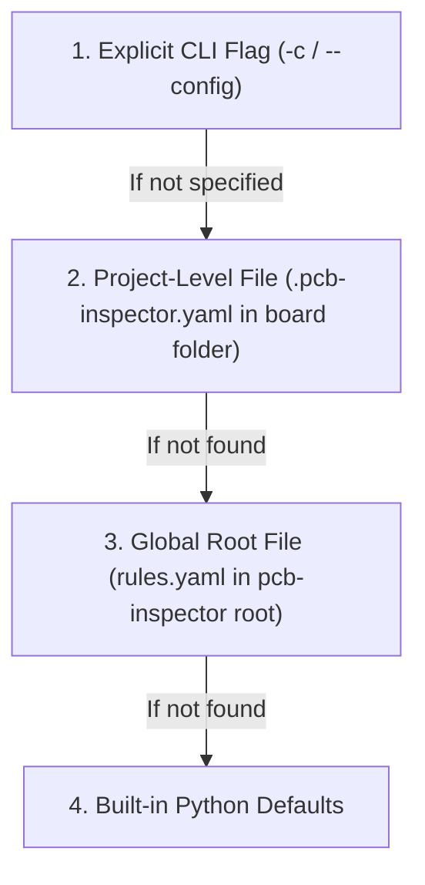

# pcb-inspector User Manual & Configuration Guide

This manual provides practical instructions for using `pcb-inspector`, configuring rules, setting up per-project overrides, and integrating automated PCB audits into your design workflows and CI/CD pipelines.

---

## Table of Contents

1. [Quickstart & Basic CLI Usage](#1-quickstart--basic-cli-usage)
2. [CLI Commands & Options](#2-cli-commands--options)
3. [Configuration System](#3-configuration-system)
   - [Configuration Resolution Hierarchy](#configuration-resolution-hierarchy)
   - [Global Configuration (`rules.yaml`)](#global-configuration-rulesyaml)
   - [Per-Project Overrides (`.pcb-inspector.yaml`)](#per-project-overrides-pcb-inspectoryaml)
4. [Configuration Parameters Reference](#4-configuration-parameters-reference)
5. [Active Inspection Rules Catalog](#5-active-inspection-rules-catalog)
6. [CI/CD & Automated Pipelines](#6-cicd--automated-pipelines)

---

## 1. Quickstart & Basic CLI Usage

### Check Environment & KiCad Detection
Verify that `pcb-inspector` and `kicad-cli` are correctly detected:
```bash
pcb-inspector version
```

### List Active Inspection Rules
See all registered heuristic and deterministic rules:
```bash
pcb-inspector rules
```

### Inspect a KiCad Project or Board
Run a full design audit on a project or PCB file:
```bash
# Audit a KiCad PCB layout
pcb-inspector check path/to/board.kicad_pcb

# Audit a complete KiCad project folder
pcb-inspector check path/to/project_dir/

# Audit with a Markdown report exported to file
pcb-inspector check path/to/board.kicad_pcb -o report.md -f markdown

# Audit with strict CI exit code on WARNING or CRITICAL
pcb-inspector check path/to/board.kicad_pcb --fail-on WARNING
```

---

## 2. CLI Commands & Options

### `pcb-inspector version`
Displays the installed version of `pcb-inspector` and the detected `kicad-cli` path and version.

### `pcb-inspector rules`
Prints a formatted table of all currently registered rules, their unique Rule ID, category, and default severity.

### `pcb-inspector check [OPTIONS] PROJECT_PATH`

| Option | Flag | Default | Description |
| :--- | :--- | :--- | :--- |
| `PROJECT_PATH` | *(Argument)* | *(Required)* | Path to `.kicad_pro`, `.kicad_pcb`, `.kicad_sch`, or project directory. |
| `--output` | `-o` | `None` | Path where the audit report will be written. |
| `--format` | `-f` | `markdown` | Output report format: `markdown`, `json`, or `both`. |
| `--fail-on` | N/A | `CRITICAL` | Severity threshold triggering exit code `1`: `CRITICAL`, `WARNING`, `SUGGESTION`. |
| `--config` | `-c` | `None` | Explicit path to a custom YAML configuration file. |

---

## 3. Configuration System

`pcb-inspector` uses a hierarchical configuration system, allowing you to establish global defaults across your engineering team while easily customizing rules for individual boards (e.g. high-density RF boards vs. power supplies vs. simple sensor breakout boards).

### Configuration Resolution Hierarchy

When running an audit, `pcb-inspector` resolves configuration in the following order (first match wins):



1. **Explicit CLI Flag (`-c / --config`)**: Highest priority. Overrides everything.
2. **Project Directory Override (`.pcb-inspector.yaml`)**: Placed directly inside the individual KiCad project folder (alongside `.kicad_pro` / `.kicad_pcb`).
3. **Global Workspace File (`rules.yaml`)**: Located in the root directory of the tool/repository.
4. **Built-in Defaults**: Hardcoded safe engineering defaults in the Python codebase.

---

### Global Configuration (`rules.yaml`)

The repository root contains `rules.yaml`, which defines default thresholds for all inspections:

```yaml
# Global Verification Pipeline Configuration
enable_drc: true
enable_erc: true
enable_heuristics: true
enable_vision: false

# Heuristic Rule Defaults
max_decoupling_distance_mm: 3.5
min_power_trace_width_mm: 0.35
max_diff_pair_skew_mm: 0.15
max_switching_loop_area_mm2: 50.0
min_gnd_overlap_ratio: 0.85

# Severity threshold for exit code 1
fail_on: "CRITICAL"
```

---

### Per-Project Overrides (`.pcb-inspector.yaml`)

To customize rule thresholds for a specific board without modifying global settings:

1. Copy `.pcb-inspector.yaml.example` into your board's project directory.
2. Rename it to `.pcb-inspector.yaml` (or `rules.yaml`).
3. Only specify the fields you want to override for this board.

#### Example: High-Speed / High-Density Board Override
```yaml
# .pcb-inspector.yaml (placed in your KiCad project folder)

# Require closer decoupling capacitors for high-frequency MCU/FPGA
max_decoupling_distance_mm: 2.0

# Stricter differential pair length matching (e.g. USB 2.0 / PCIe)
max_diff_pair_skew_mm: 0.08

# Strict CI: fail build on any warning
fail_on: "WARNING"

# Toggle specific rules or adjust rule-specific thresholds
custom_rules:
  # Stricter switching loop area for sensitive analog board
  HEUR-DCDC-001:
    max_loop_area_mm2: 25.0

  # Disable continuous ground check on a single-sided test jig
  HEUR-GND-001:
    enabled: false
```

---

## 4. Configuration Parameters Reference

| Parameter | Type | Default | Description |
| :--- | :--- | :--- | :--- |
| `enable_drc` | `bool` | `true` | Run official KiCad Design Rules Check via `kicad-cli`. |
| `enable_erc` | `bool` | `true` | Run official KiCad Electrical Rules Check via `kicad-cli`. |
| `enable_heuristics` | `bool` | `true` | Run spatial layout engineering heuristics (Layer 2). |
| `enable_vision` | `bool` | `false` | Run multimodal vision AI inspections (Layer 3). |
| `max_decoupling_distance_mm` | `float` | `3.5` | Maximum Euclidean distance (in mm) between an IC power pin and its nearest decoupling capacitor. |
| `min_power_trace_width_mm` | `float` | `0.35` | Minimum trace width (in mm) on recognized power rails (`VCC`, `+3V3`, `+5V`, `VDD`, etc.). |
| `max_diff_pair_skew_mm` | `float` | `0.15` | Maximum trace length difference (in mm) between positive and negative traces of a differential pair (`_P`/`_N`, `+`/`-`). |
| `max_switching_loop_area_mm2` | `float` | `50.0` | Maximum convex hull loop area (in mm²) between switching inductor, diode/FET, and input/output capacitors. |
| `min_gnd_overlap_ratio` | `float` | `0.85` | Minimum fraction of signal trace length that must run directly over a continuous ground polygon. |
| `fail_on` | `string` | `"CRITICAL"` | Finding severity that triggers non-zero exit code: `"CRITICAL"`, `"WARNING"`, `"SUGGESTION"`. |
| `custom_rules` | `dict` | `{}` | Per-rule dictionary for toggling `enabled: true/false` and custom parameters. |

---

## 5. Active Inspection Rules Catalog

| Rule ID | Name | Category | Default Severity | Description |
| :--- | :--- | :--- | :--- | :--- |
| `KICAD-DRC-001` | KiCad DRC Checker | `MANUFACTURING_DFM` | `CRITICAL` | Executes `kicad-cli pcb drc` and parses standard KiCad clearance, overlap, and unrouted errors. |
| `KICAD-ERC-001` | KiCad ERC Checker | `ELECTRICAL_SIGNAL` | `CRITICAL` | Executes `kicad-cli sch erc` and parses schematic electrical errors (floating pins, conflict nets). |
| `HEUR-DEC-001` | Decoupling Capacitor Placement | `ELECTRICAL_SIGNAL` | `WARNING` | Checks proximity of bypass/decoupling capacitors to IC power pins within `max_decoupling_distance_mm`. |
| `HEUR-PWR-001` | Power Rail Trace Width | `POWER_INTEGRITY` | `WARNING` | Verifies that traces on power nets meet or exceed `min_power_trace_width_mm` to prevent excessive IR drop. |
| `HEUR-DIFF-001` | Differential Pair Skew & Length Matching | `SIGNAL_INTEGRITY` | `WARNING` | Calculates trace length skew between complementary differential pair nets (`_P`/`_N`, `+`/`-`). |
| `HEUR-DCDC-001` | Switching Loop Area | `EMC_EMI` | `WARNING` | Computes the geometric loop area of high-di/dt switching nodes in DC-DC converters to minimize radiated EMI. |
| `HEUR-GND-001` | Ground Return Path Continuity | `SIGNAL_INTEGRITY` | `WARNING` | Checks for continuous ground reference beneath high-speed signal tracks using polygon clipping. |

---

## 6. CI/CD & Automated Pipelines

You can easily integrate `pcb-inspector` into GitHub Actions or GitLab CI to fail pull requests that introduce layout regressions.

### GitHub Actions Example:
```yaml
name: PCB Design Audit

on:
  push:
    branches: [ main ]
  pull_request:
    paths:
      - '**.kicad_pcb'
      - '**.kicad_sch'
      - '**.kicad_pro'

jobs:
  inspect:
    runs-on: ubuntu-latest
    steps:
      - name: Checkout repository
        uses: actions/checkout@v4

      - name: Install uv & Python
        uses: astral-sh/setup-uv@v5
        with:
          python-version: "3.11"

      - name: Install pcb-inspector
        run: uv pip install -e .

      - name: Run PCB Inspector
        run: |
          pcb-inspector check hardware/mainboard.kicad_pcb \
            --format both \
            --output audit-report.md \
            --fail-on WARNING

      - name: Upload Audit Artifacts
        if: always()
        uses: actions/upload-artifact@v4
        with:
          name: pcb-audit-report
          path: |
            audit-report.md
            audit-report.json
```
