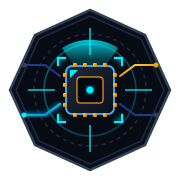
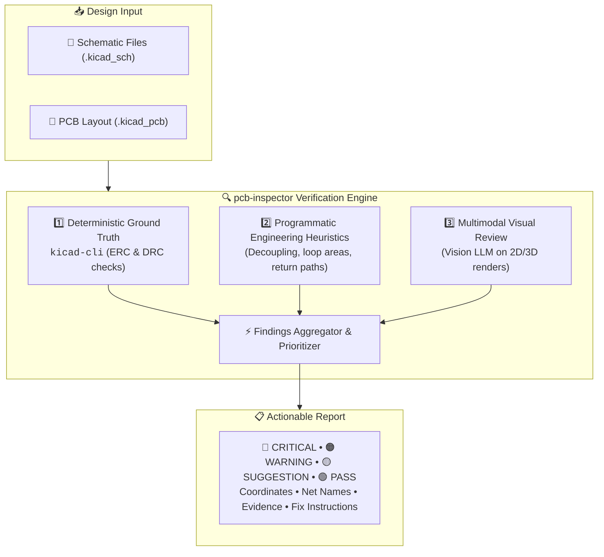
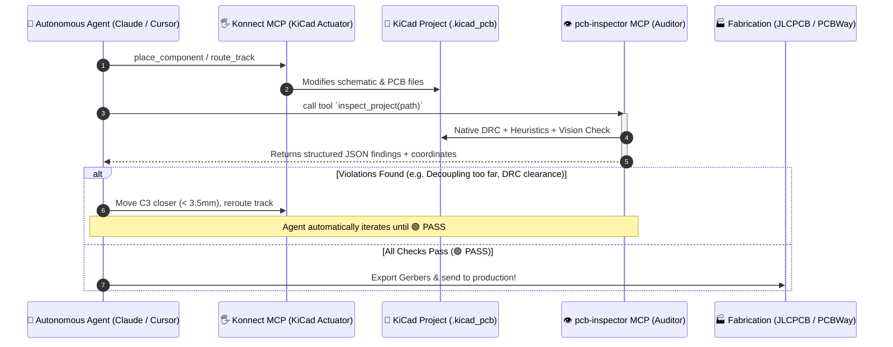

# pcb-inspector

### *Automated Multimodal Design Reviewer & Linter for KiCad Projects*

Catch placement flaws, decoupling issues, routing problems, and mixed-signal design risks **before** sending your board to fabrication.

  
  
  
  
  
  
  
  
  

[🎯 What is it?](#-what-is-it) • [📖 User Manual](MANUAL.md) • [🧠 Verification Pipeline](#-multi-layer-verification-pipeline) • [🤖 MCP Server & Agent Loop](#-mcp-server--agentic-integration) • [🏗️ Architecture](#️-design-philosophy) • [🚀 Use Cases](#-use-cases) • [🛠️ Roadmap](#️-planned-integrations) • [📄 License](#-license)

---

> [!WARNING]
> ### 🚧 Project Under Active Construction
> **`pcb-inspector` is currently under heavy foundational development and is NOT ready for production use.**  
> APIs, CLI interfaces, and inspection heuristics are actively evolving and subject to breaking changes. **Please do not run or rely on this tool on production hardware designs yet.**  
> Feel free to star or watch the repository to track our progress!

## 🎯 What is it?

`pcb-inspector` is a multi-layer hardware verification and design-review pipeline for KiCad projects.

Traditional DRC/ERC tools are essential, but they primarily verify explicit electrical and geometric rules. `pcb-inspector` adds higher-level **layout analysis, engineering heuristics, and multimodal visual review** to identify potential design issues that may pass standard CAD checks.

It can run standalone as a **CLI or GitHub Action** on manually designed boards, or integrate with agentic PCB workflows such as **Konnect** to create a closed-loop design → audit → fix → verify workflow.

> [!TIP]
> **Don't just generate a PCB. Independently inspect it before you manufacture it.**  
> *Design. Inspect. Fix. Verify.*

---

## 🧠 Multi-Layer Verification Pipeline

`pcb-inspector` approaches design verification through three complementary layers of defense:

### 1. Deterministic Ground Truth
Runs KiCad's native verification tools through `kicad-cli`:
- **ERC** — Electrical Rules Check
- **DRC** — Design Rules Check
- Connectivity & netlist verification
- Clearance and short-circuit detection
- Unconnected pins and nets
- Manufacturing and fabrication constraint violations

*These results form the deterministic baseline for the entire audit.*

---

### 2. Programmatic Design Analysis
Computes configurable spatial, geometric, and electrical heuristics directly from schematic and layout topology:
- **Decoupling capacitor placement:** Proximity and loop inductance relative to IC power pins.
- **Power & ground connectivity:** Star routing, plane integrity, and copper pour continuity.
- **Switching regulators:** DC/DC converter high $di/dt$ switching-loop geometry and diode placement.
- **High-current path analysis:** Trace width, copper weight, and via current capacity.
- **Critical net routing:** Sensitive analog traces shielded from high-speed digital switching.
- **Ground-plane & return paths:** Identification of return path interruptions and ground splits.
- **Differential pairs:** Length tuning, skew matching, and continuous ground reference.
- **Thermal relationships:** Proximity of heat-sensitive components to power dissipation hot spots.

> [!NOTE]
> Rules and thresholds are configurable via YAML/JSON profiles, allowing the audit to adapt between high-power, RF, mixed-signal, and ultra-low-power designs.

---

### 3. Multimodal Visual Review
Uses Vision-capable models to inspect rendered **2D and 3D PCB views**, catching layout anti-patterns that resist formulation into rigid CAD rules:
- **Component placement:** Clustering balance, awkward orientations, and assembly congestion.
- **Routing aesthetics & quality:** Unnecessary detours, awkward acute angles, and excessive vias.
- **Silkscreen & DFM:** Overlapping silkscreens, unreadable reference designators, and obstructed testpoints.
- **Polarity & Pin 1:** Missing or ambiguous diode/electrolytic polarity and IC Pin 1 indicators.
- **Mechanical fit:** Edge clearance, mounting hole keepouts, and connector access clearances.
- **Schematic intent vs. PCB:** Visual cross-check ensuring physical layout reflects functional schematic grouping.

*Vision review acts as an automated "peer engineer over your shoulder" — probabilistic guidance backed by deterministic verification.*

---

### 4. Structured, Actionable Feedback
Produces a clean, prioritized report tailored for both human review and automated agent consumption:

| Severity | Meaning | Example |
| :--- | :--- | :--- |
| 🔴 **`CRITICAL`** | Functional failure or manufacturing blocker | DRC short, bypass capacitor on wrong side of via |
| 🟠 **`WARNING`** | Signal integrity, thermal, or EMI hazard | High-speed trace crossing ground slot, undersized power trace |
| 🟡 **`SUGGESTION`** | DFM, readability, or best-practice refinement | Obscured silkscreen, sub-optimal component rotation |
| 🟢 **`PASS`** | Clean verification | All power rails decoupled within target metrics |

Each finding includes:
- Component designators (e.g., `U1`, `C14`, `L2`)
- Affected nets & physical PCB coordinates $(X, Y)$
- Measured values vs. expected thresholds
- Visual snapshots / highlighted bounding boxes
- Concrete, actionable remediation instructions

---

## 🤖 MCP Server & Agentic Integration

`pcb-inspector` provides a native **Model Context Protocol (MCP)** server, making it a drop-in verification tool for AI coding and design agents (Claude Desktop, Cursor, Antigravity).

### 🤝 The Dual-MCP Synergy: `Konnect` + `pcb-inspector`

In modern autonomous hardware workflows, agents need both **actuators** (to edit KiCad designs) and **sensors/auditors** (to verify physical correctness):

| Role | MCP Server | Function |
| :--- | :--- | :--- |
| **The Hands (Actuator)** | **`Konnect`** *(by mixelpixx)* | Adds components, connects pins, routes traces, modifies footprints in KiCad. |
| **The Brain & Eyes (Auditor)** | **`pcb-inspector`** *(this project)* | Validates DRC/ERC, decoupling proximity, switching loops, ground cuts, and silkscreen DFM. |

Together, they enable a **closed-loop autonomous self-correction loop**:

### 🛠️ Exposed MCP Tools

When launched with `pcb-inspector mcp`, the server provides:

- `inspect_project(project_path: str)`: Runs the complete 3-layer audit (DRC, Heuristics, Vision) and returns prioritized findings.
- `check_decoupling(pcb_path: str, max_distance_mm: float = 3.5)`: Rapid spatial analysis of IC power pins and decoupling bypass capacitors.
- `run_drc(pcb_path: str)`: Fast deterministic DRC check returning structured clearance and connectivity violations.
- `get_actionable_fixes(project_path: str)`: Machine-readable $(X, Y)$ coordinate patches and step-by-step remediation commands for agents.

---

## 🏗️ Design Philosophy

`pcb-inspector` enforces a strict separation of concerns across its verification tiers:

| Layer | Purpose | Authority | Predictability |
| :--- | :--- | :--- | :--- |
| **KiCad DRC/ERC** | Explicit electrical & geometric constraints | Deterministic | Exact |
| **Programmatic Analysis** | Measurable engineering heuristics & physics | Deterministic / Configurable | High |
| **Vision Review** | Spatial sanity, aesthetics & assembly review | Probabilistic | Heuristic |

> [!IMPORTANT]
> No single layer catches everything. By stacking deterministic CAD checks with spatial analytics and visual AI, `pcb-inspector` achieves coverage that standard DRC cannot match.

---

## 🚀 Use Cases

- 🤖 **AI-Generated PCB Designs:** Autonomous validation for LLM/agent-designed boards.
- ⚡ **Mixed-Signal & Audio:** Protecting analog front-ends from noisy digital microcontrollers.
- 🔋 **Power Electronics:** Verifying DC/DC buck/boost switching loops and thermal copper pours.
- 📡 **RF & High-Speed Digital:** Return paths, differential pair continuity, and keepout verification.
- ⏱️ **Pre-Fabrication Sanity Check:** Catching Silkscreen, footprint, and assembly bugs before purchasing silicon.
- 🔄 **CI/CD for Hardware:** Automated regression testing on every Git pull request.

---

## 🛠️ Planned Integrations & Roadmap

- [x] Three-tier verification architecture design & domain data models
- [x] KiCad 8 / 9 / 10 CLI automation wrappers (`kicad-cli`) & DRC/ERC JSON parsers
- [x] Programmatic spatial & physical heuristics (decoupling, DC/DC loops, return paths)
- [ ] Multimodal vision inspection engine (Gemini Flash 3.8, Fable 5, GPT-6 Astra)
- [ ] Built-in MCP Server (`pcb-inspector mcp`) for autonomous agent loops
- [ ] Konnect agentic closed-loop integration & auto-repair workflow
- [ ] Automated 2D SVG & 3D raytraced board rendering
- [ ] Gerber & drill file inspection
- [ ] GitHub Action (`pcb-inspector-action`)
- [ ] Interactive HTML / Markdown visual report viewer

---

## ⚠️ Engineering Disclaimer

`pcb-inspector` is an automated design-review tool, not a substitute for professional engineering certification. Vision models and heuristic checks may yield false positives or overlook specific corner-case failure modes. Final sign-off and safety-critical decisions remain the sole responsibility of the engineer.

---

## 📄 License & Author

This project is licensed under the **MIT License** — see the [LICENSE](LICENSE) file for complete details.

**Author & Maintainer:**  
👤 **Krzysztof Pika** ([@takzen](https://github.com/takzen))  
📫 Contact: [takzen.app@gmail.com](mailto:takzen.app@gmail.com)
