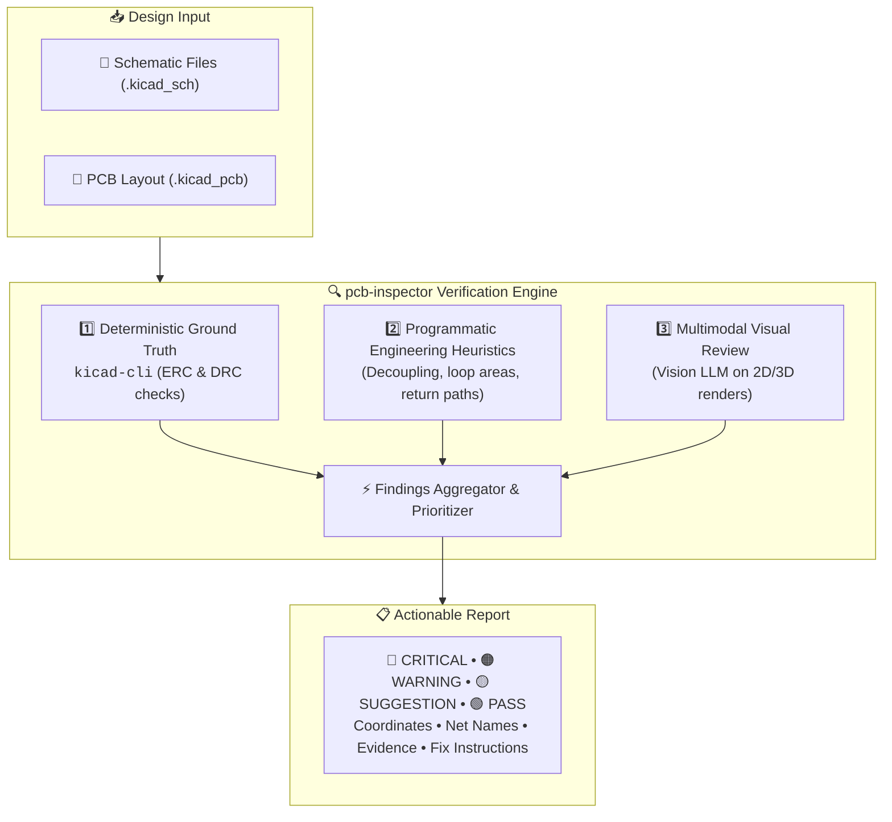
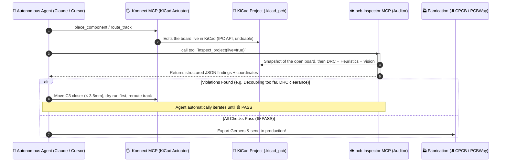

<div align="center">


# pcb-inspector

### *Automated Multimodal Design Reviewer & Linter for KiCad Projects*

Catch placement flaws, decoupling issues, routing problems, and mixed-signal design risks **before** sending your board to fabrication.

<p align="center">
  <a href="LICENSE"></a>
  <a href="https://github.com/takzen/pcb-inspector/releases/tag/v0.1.0"></a>
  <a href="#"></a>
  <a href="https://kicad.org"></a>
  <a href="https://python.org"></a>
  <a href="#-mcp-server--agentic-integration"></a>
  <a href="#-3-multimodal-visual-review"></a>
  <a href="https://github.com/takzen/pcb-inspector/pulls"></a>
</p>

[🎯 What is it?](#-what-is-it) • [⚡ Quickstart](#-quickstart--installation) • [📖 User Manual](MANUAL.md) • [🧠 Verification Pipeline](#-multi-layer-verification-pipeline) • [🤖 MCP Server & Agent Loop](#-mcp-server--agentic-integration) • [🏗️ Architecture](#️-design-philosophy) • [🚀 Use Cases](#-use-cases) • [🛠️ Roadmap](#️-roadmap--progress) • [📄 License](#-license)

---

</div>

> [!NOTE]
> **`pcb-inspector` v0.1.0 is now live!**  
> The 3-layer verification engine, built-in MCP server, interactive HTML reporting, and GitHub Action are fully functional. Check out the [📖 User Manual & Configuration Guide (MANUAL.md)](MANUAL.md) for practical examples, rule catalog, and per-project override guides.

## 🎯 What is it?

`pcb-inspector` is a multi-layer hardware verification and design-review pipeline for KiCad projects.

Traditional DRC/ERC tools are essential, but they primarily verify explicit electrical and geometric rules. `pcb-inspector` adds higher-level **layout analysis, engineering heuristics, and multimodal visual review** to identify potential design issues that may pass standard CAD checks.

It can run standalone as a **CLI or GitHub Action** on manually designed boards, or integrate with agentic PCB workflows such as **Konnect** to create a closed-loop design → audit → fix → verify workflow.

> [!TIP]
> **Don't just generate a PCB. Independently inspect it before you manufacture it.**  
> *Design. Inspect. Fix. Verify.*

---

## ⚡ Quickstart & Installation

### Installation

```bash
# Using uv (recommended)
uv pip install pcb-inspector

# Or install from source
uv pip install "git+https://github.com/takzen/pcb-inspector.git"

# Optional: Claude (Fable / Opus) as the vision model
uv pip install "pcb-inspector[claude]"
```

> [!IMPORTANT]
> Layer 1 (DRC/ERC) and hosted vision renders both need **KiCad 8+** with `kicad-cli` on `PATH`
> (or `kicad_cli_path` in the config). Without it, Layer 1 is reported as **not run** rather than
> silently skipped; pass `--require-kicad-cli` to make that a failure, as the bundled GitHub
> Action does.

### Essential CLI Commands

```bash
# 1. Full 3-layer audit (DRC + Heuristics + Vision) with interactive HTML report
pcb-inspector check path/to/board.kicad_pcb -o report.html -f html

# 2. Fast deterministic DRC/ERC only (native KiCad)
pcb-inspector drc path/to/board.kicad_pcb

# 3. Spatial & physical engineering heuristics only
pcb-inspector analyze path/to/board.kicad_pcb

# 4. Dedicated Multimodal AI Vision Review (Gemini Flash 3.8, Fable 5, GPT-6 Astra)
pcb-inspector vision path/to/board.kicad_pcb --model gemini-3.8-flash

# 5. Continuous Watch Mode (automatically re-checks on board save)
pcb-inspector check path/to/board.kicad_pcb --watch

# 6. Launch Model Context Protocol (MCP) server for AI agents
pcb-inspector mcp --transport stdio
```

---

## 🧠 Multi-Layer Verification Pipeline

`pcb-inspector` approaches design verification through three complementary layers of defense:



### 1. Deterministic Ground Truth
Runs KiCad's native verification tools through `kicad-cli`:
- **ERC** — Electrical Rules Check
- **DRC** — Design Rules Check
- Connectivity & netlist verification, including schematic parity: footprints missing from
  or extra on the board and pads on the wrong net, grouped by kind
- Clearance and short-circuit detection
- Unconnected pins and nets
- Manufacturing and fabrication constraint violations

*These results form the deterministic baseline for the entire audit.*

---

### 2. Programmatic Design Analysis
Five rules computed directly from the layout, reading the design intent KiCad records: net classes
from the `.kicad_pro`, the copper stack order, and each pad's schematic pin name.

- **Decoupling capacitor placement** (`HEUR-DEC-001`) — distance from every IC supply pin to its
  nearest bypass capacitor, adding the board thickness for capacitors on the opposite side. Supply
  pins are recognised by their schematic pin name (`VDD`, `VCC`, `3.3V`, `+VS`…) as well as the
  net name; a bias or reference net such as `BIAS_1.65V` is not mistaken for a rail.
- **Power rail trace width** (`HEUR-PWR-001`) — one finding per net and layer. A trace narrower
  than **its own net class** is a warning; one that matches its net class but sits below the
  configured power-rail guideline is a suggestion, since KiCad treats net class widths as defaults.
- **Differential pair skew** (`HEUR-DIFF-001`) — length mismatch across `_P/_N`, `+/-`,
  `_DP/_DM` and `H/L` pairs, counting curved (arc) routing and via transitions. Only pairs named
  as a fast interface (USB, HDMI, PCIe, LVDS, Ethernet, clocks…) can be critical; a CAN bus or an
  analog sensor pair is a suggestion, since millimetres of skew are picoseconds.
- **Switching regulator loop area** (`HEUR-DCDC-001`) — switching nodes confirmed by a declared
  `SW`/`LX` pin or by inductor-to-converter topology, never by net name alone.
- **Ground reference** (`HEUR-GND-001`) — the share of each signal segment lying over a ground
  plane on an **adjacent** copper layer, read from the board's physical stack order.

> [!NOTE]
> Thresholds are configurable globally and per rule via `custom_rules` in YAML; any rule can be
> disabled there. See [MANUAL.md](MANUAL.md) for every key.

Not yet implemented, and listed in the [Roadmap](#️-roadmap--progress): thermal proximity of
heat-sensitive parts to hot spots, analog/digital separation, copper-weight and via current
capacity, and star-routing checks.

---

### 3. Multimodal Visual Review
Each side of the board is raytraced to PNG with `kicad-cli pcb render` and reviewed in its own
request by Gemini, OpenAI or Claude (Fable/Opus). The API key is read from the chosen provider's
own variable — `GOOGLE_API_KEY` or `GEMINI_API_KEY`, `OPENAI_API_KEY` or `ANTHROPIC_API_KEY` —
exported or kept in a `.env` file in the directory you run from; use `--vision-model mock` to
run offline. A spent daily quota is reported at once rather than retried. Hosted models need the `kicad-cli` render; the tool refuses to send them anything
else rather than fail at the provider. Vision models catch layout anti-patterns that resist
formulation into rigid CAD rules:
- **Component placement:** Clustering balance, awkward orientations, and assembly congestion.
- **Routing aesthetics & quality:** Unnecessary detours, awkward acute angles, and excessive vias.
- **Silkscreen & DFM:** Overlapping silkscreens, unreadable reference designators, and obstructed testpoints.
- **Polarity & Pin 1:** Missing or ambiguous diode/electrolytic polarity and IC Pin 1 indicators.
- **Mechanical fit:** Edge clearance, mounting hole keepouts, and connector access clearances.
- **Schematic intent vs. PCB:** Visual cross-check ensuring physical layout reflects functional schematic grouping.

*Vision review acts as an automated "peer engineer over your shoulder" — probabilistic guidance backed by deterministic verification.*

---

### 4. Structured, Actionable Feedback
Produces a clean, prioritized report tailored for both human review and automated agent consumption:

| Severity | Meaning | Example |
| :--- | :--- | :--- |
| 🔴 **`CRITICAL`** | Functional failure or manufacturing blocker | DRC short, bypass capacitor on wrong side of via |
| 🟠 **`WARNING`** | Signal integrity, thermal, or EMI hazard | High-speed trace crossing ground slot, undersized power trace |
| 🟡 **`SUGGESTION`** | DFM, readability, or best-practice refinement | Obscured silkscreen, sub-optimal component rotation |
| 🟢 **`PASS`** | Clean verification | All power rails decoupled within target metrics |

Each finding includes:
- Component designators (e.g., `U1`, `C14`, `L2`)
- Affected nets & physical PCB coordinates $(X, Y)$
- Measured values vs. expected thresholds
- Visual snapshots / highlighted bounding boxes
- Concrete, actionable remediation instructions

---

## 🤖 MCP Server & Agentic Integration

`pcb-inspector` provides a native **Model Context Protocol (MCP)** server, making it a drop-in verification tool for AI coding and design agents (Claude Desktop, Cursor, Antigravity).

### 🤝 The Dual-MCP Synergy: `Konnect` + `pcb-inspector`

In modern autonomous hardware workflows, agents need both **actuators** (to edit KiCad designs) and **sensors/auditors** (to verify physical correctness):

| Role | MCP Server | Function |
| :--- | :--- | :--- |
| **The Hands (Actuator)** | **`Konnect`** *(by mixelpixx)* | Adds components, connects pins, routes traces, modifies footprints in KiCad. |
| **The Brain & Eyes (Auditor)** | **`pcb-inspector`** *(this project)* | Validates DRC/ERC, decoupling proximity, switching loops, ground cuts, and silkscreen DFM. |

Together, they enable a **closed-loop autonomous self-correction loop**:



Konnect edits the board in the running KiCad; the file on disk changes only when someone
saves. The audit step therefore reads the **open board** with `live=true` (or `--live` on the
CLI), unsaved edits included, through KiCad's API. It needs `pip install 'pcb-inspector[live]'`
and *Preferences → Plugins → Enable KiCad API* in KiCad 10. Konnect's own plans are worth
auditing before they are applied: on a real board its `place_decoupling_caps` dry run for one
op-amp gathered every capacitor sharing ground, scoring itself 70 → 10.

### 🛠️ Exposed MCP Tools

When launched with `pcb-inspector mcp`, the server provides:

- `inspect_project(project_path: str = "", live: bool = False)`: Runs the complete 3-layer audit (DRC, Heuristics, Vision) and returns prioritized findings. Every tool takes `live=true` in place of a path.
- `check_decoupling(pcb_path: str, max_distance_mm: float = 3.5)`: Rapid spatial analysis of IC power pins and decoupling bypass capacitors.
- `run_drc(pcb_path: str)`: Fast deterministic DRC check returning structured clearance and connectivity violations.
- `get_actionable_fixes(project_path: str)`: Machine-readable $(X, Y)$ coordinate patches and step-by-step remediation commands for agents.

---

## 🏗️ Design Philosophy

`pcb-inspector` enforces a strict separation of concerns across its verification tiers:

| Layer | Purpose | Authority | Predictability |
| :--- | :--- | :--- | :--- |
| **KiCad DRC/ERC** | Explicit electrical & geometric constraints | Deterministic | Exact |
| **Programmatic Analysis** | Measurable engineering heuristics & physics | Deterministic / Configurable | High |
| **Vision Review** | Spatial sanity, aesthetics & assembly review | Probabilistic | Heuristic |

> [!IMPORTANT]
> No single layer catches everything. By stacking deterministic CAD checks with spatial analytics and visual AI, `pcb-inspector` achieves coverage that standard DRC cannot match.

---

## 🚀 Use Cases

- 🤖 **AI-Generated PCB Designs:** Autonomous validation for LLM/agent-designed boards.
- ⚡ **Mixed-Signal & Audio:** Protecting analog front-ends from noisy digital microcontrollers.
- 🔋 **Power Electronics:** Verifying DC/DC buck/boost switching loops and thermal copper pours.
- 📡 **RF & High-Speed Digital:** Return paths, differential pair continuity, and keepout verification.
- ⏱️ **Pre-Fabrication Sanity Check:** Catching Silkscreen, footprint, and assembly bugs before purchasing silicon.
- 🔄 **CI/CD for Hardware:** Automated regression testing on every Git pull request.

---

## 🛠️ Roadmap & Progress

### v0.1.0 (Released)
- [x] Three-tier verification architecture design & domain data models
- [x] KiCad 8 / 9 / 10 CLI automation wrappers (`kicad-cli`) & DRC/ERC JSON parsers
- [x] Programmatic spatial & physical heuristics (decoupling, DC/DC loops, return paths, diff pairs, power traces)
- [x] Multimodal vision inspection engine (Gemini Flash 3.8, Fable 5, GPT-6 Astra)
- [x] Board renderer for vision review (superseded — see Unreleased)
- [x] Built-in Model Context Protocol (MCP) Server (`pcb-inspector mcp`) for autonomous agent loops
- [x] Konnect agentic closed-loop integration & `ActionableFix` auto-repair coordinates
- [x] Continuous watch mode (`--watch`) for real-time iterative layout reviews
- [x] Multi-format reporting: Interactive HTML5 (zero CDN), Markdown, JSON, and Terminal Rich
- [x] Reusable GitHub Action (`.github/actions/pcb-inspector`) for CI/CD pipelines
- [x] Golden Sample reference benchmark boards (`clean_board` & `flawed_board`)

### Unreleased — reliability and accuracy
- [x] Live audits of the board open in KiCad 10 (`--live`, MCP `live=true`), so a repair loop
  driven through Konnect sees its own unsaved edits
- [x] Vision reads its API key from `.env` too, accepts `GOOGLE_API_KEY` as Google's own tools
  do, and stops retrying once a daily quota is spent (verified against the live Gemini API)
- [x] Checked against a real KiCad 10 analog board: the CLI no longer crashes on ERC titles
  such as `ERC [/]:`, supply rails are recognised the same way by every rule (`+3.3V` was
  missed, `BIAS_1.65V` was taken for one), and DRC checks schematic parity
- [x] A target holding no board or schematic is a usage error (exit 2), no longer a PASSED
  audit with a 100/100 health score; the MCP tools return an error for it too
- [x] Never report a clean board for work not done: failed or missing `kicad-cli` is a finding,
  every run records which layers executed, and the GitHub Action installs KiCad
- [x] Parser reads the KiCad 10 file format (nets named inline), curved (arc) tracks,
  multi-layer zones, net classes, the layer stack and pad
  pin names; pad positions match `pcbnew` exactly
- [x] Heuristics fixed for false positives on connectors, SWD/PHY nets and matched pairs, with
  repair actions keyed to the rule that produced them
- [x] Vision review works with hosted models: raytraced PNG per side via `kicad-cli pcb render`,
  Claude through the Anthropic SDK with refusal fallbacks, Gemini requests reach the configured
  model instead of being rewritten to `gemini-2.0-flash`
- [x] Findings correlation, ground-reference check and watch mode made fast enough for
  26,000-track boards
- [x] HTML report search and category filtering; smoke tests over KiCad's own demo boards

### Future Enhancements (v0.2.0+)
- [ ] Thermal rule: heat-sensitive parts near power dissipation hot spots
- [ ] Analog/digital separation: analog traces crossing digital buses or plane splits
- [ ] Via current capacity and copper-weight-aware trace width
- [ ] Star-routing and ground-split checks
- [ ] Direct Gerber (RS-274X) & Excellon drill file fabrication inspection
- [ ] Automated IPC-2221 conductor spacing & current-carrying capacity calculator
- [ ] Differential TDR waveform simulation for transmission lines

---

## ⚠️ Engineering Disclaimer

`pcb-inspector` is an automated design-review tool, not a substitute for professional engineering certification. Vision models and heuristic checks may yield false positives or overlook specific corner-case failure modes. Final sign-off and safety-critical decisions remain the sole responsibility of the engineer.

---

## 📄 License & Author

This project is licensed under the **MIT License** — see the [LICENSE](LICENSE) file for complete details.

**Author & Maintainer:**  
👤 **Krzysztof Pika** ([@takzen](https://github.com/takzen))  
📫 Contact: [takzen.app@gmail.com](mailto:takzen.app@gmail.com)
